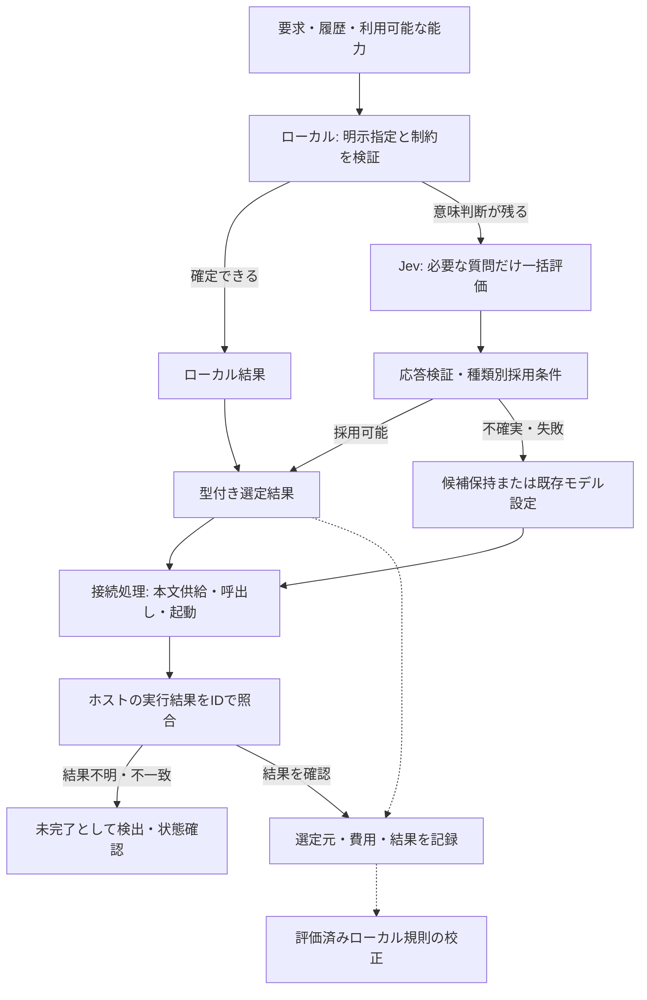

# JevRouterの分析・移植方針

> 2026-09-23 更新: agmsg 1.4.0 の jev 対応により、ateam の model/effort 自動選択（auto）と `jev-routing route --json` を撤去した。本書の該当記述は履歴として残す。

## 結論

推奨度 ⭐5: JevRouterの**共通能力カタログと型付き選定契約**を現行Go実装へ移植し、**自動問い合わせ→適用→実行結果の照合**までを実装範囲にする。ローカルは明示指定・制約・検証済みの確定規則を処理し、意味の判断が残る案件をJevへ渡す。モデルと`effort`は有効な組から選び、ateamの起動直前に適用する。

利用者の追加要件を反映し、判断CLIが選定結果を返すだけでは完了としない。[自動接続仕様](jevrouter-host-integration.md)を追加した。エージェントが自発的にCLIを呼ぶことに依存せず、起動ラッパー・既存プロキシ・ateamに接続する。適用不能や実行結果不明は明示的な未完了とし、成功に数えない。

ダッシュボード更新の追加依頼も対象に含める。[可視化仕様](jevrouter-dashboard.md)で、Jevの稼働場所・使わない理由・実適用・Jev使用量・総トークンと完了時間の比較を定義する。上流の状態集計を採用し、不足する使用量と比較は既存の計測境界から補う。

上流には六つの専用分析器が完成しているわけではない。Model／Subagentsは共通選定器へ与える候補の種類であり、難易度分析・`effort`選択・AGMSG連携は新規設計が必要である。「上流の方が高精度」「Jevへ増やせば必ず高速・低トークン」は今回の静的調査では確認できていない。

実装工程は[専用計画](../plans/jevrouter-migration/PLAN.md)に記載した。既存のルート`PLAN.md`と`plan/`はツール選定比較実験の計画なので保持する。

## 調査対象と根拠

- 調査日: 2026-09-20。
- 現行 `jev-routing`: `68d843294cff04c0a5706287b9c3477a2fabcc26`。以下`R/`。
- 上流 [BillionsBobby/JevRouter](https://github.com/BillionsBobby/JevRouter/tree/7378f1d06b113b86b71de5f839c9058d381874cb): `7378f1d06b113b86b71de5f839c9058d381874cb`。以下`U/`。
- クローン: `/tmp/jevrouter-analysis.Rmu8lg/JevRouter`。ソース参照先は一時ディレクトリの存続に依存しないようコミットを固定する。
- ateam正本: `/home/takets/repos/private_dotfiles/agents/skills/ateam`。以下`A/`。
- 名簿正本: `/home/takets/repos/private_dotfiles/agents/skills/agmsg-teams`。以下`T/`。
- `aterm`は実行パス上に見つからなかった。今回確認できた統合経路は`ateam → agmsg/scripts/spawn.sh`。別の`aterm`実装との互換性は未検証。
- 利用可能なツール一覧にJevルーティングMCPとシンボル検索機能がなかったため、ファイル・テキスト検索で確認した。`.serena/memories`は空。
- 過去の[効率分析](jev-tool-selection-efficiency-analysis.md)、[互換性レビュー](../reviews/jev-agent-efficiency-compatibility-review.md)、[採点契約](selection-benchmark.md)を参照。ホスト到達・書換え適用・実タスク成功を分離し、キャッシュの同一性と全Jev費用を確認する指摘を今回にも適用する。

### 現行で既にあるもの

| 実装 | 確認結果と今回の扱い |
|---|---|
| `R/internal/proxy/options.go:14`、`:34` | `local / jev / hybrid`と`filter / forced / baseline`が存在する。選定元と適用方法を別軸のまま再利用する |
| `R/internal/plan/plan.go:292` | 履歴・残件・語句からツールを選定。`:327`の固定`Confidence: 0.86`や`:347`の`score/8`は実測正答率ではない |
| `R/internal/proxy/rewrite.go:237` | `hybrid`はローカル値が`0.85`未満のときだけJevへ問い合わせる。前記の固定値が問い合わせを抑止する |
| `R/internal/proxy/rewrite.go:1262` | ツール・必要性・工程・直前失敗・同一ツール継続を同じJev要求で評価済み。一括問い合わせは新規性ではない |
| `R/internal/jev/jev.go:140`、`:565` | HTTP要求・入力予算・応答処理を再利用する。候補と説明だけで予算超過なら無理に送らず保留する |
| `R/internal/jev/jev.go:512` | キャッシュキーにはstate・質問・目的・モデル・接続先が既に含まれる。上流のキャッシュへ置換しない |
| `R/internal/proxy/rewrite.go:361`、`options.go:89` | `JEV_ARGS_MODEL`は特定ツールの引数生成モデルの固定置換。難易度に基づくModel分析とは別機能 |
| `R/cmd/jev-routing/main.go:3`、`:40` | 現行はHTTPプロキシとCLIでありMCPサーバーではない。新しい判断入口もCLIとし、MCPサーバーは追加しない |

## 六分類の移植内容

上流の`U/src/types.ts:1`は`skill / mcp_tool / cli / dsh / model / subagent`。以下のファイル参照は上記の固定コミットに対応する。

| 分類 | 上流の実装と根拠 | 現行への移植・補完 | 適用先 |
|---|---|---|---|
| Model | `examples/capabilities/model.gpt-6-terra.json:1`、`src/provider.ts:295`。性能・費用等の説明を持つ候補から共通Choiceで選択 | 確定したホストで使える`(model, effort)`の組、固定／自動方針、品質制約、失敗時復帰を追加。モデル名や料金を上流例から転記しない | ateamの起動前。現在実行中の親エージェントのモデルは変更しない |
| Subagents | `examples/capabilities/subagent.researcher.json:1`。役割・固定モデル・予算を持つ候補 | 委譲の要否、許可された役割の選択、重複起動防止を追加。タスクをJevに自由生成させず既存の分担入力を使う | 既存のAgentツール／ateam。明示されたチーム人数・役割・ホストは保持 |
| Skills | `src/discovery.ts:10`。`SKILL.md`の名前・説明等を取得 | ホストの実際のスキル一覧を優先し、メタデータを選定。明示スキルと必須条件は保持 | 選定した本文をホストの入力へ実際に供給し、本文配達と、その指示に沿った作業の成功を別々に確認する |
| MCP Tools | `src/mcp.ts:20`。サーバー起動・`initialize`・`tools/list`で発見 | 現行プロキシが受け取る実ツール一覧を再利用。外部入口は既存接続のスナップショットを受け取る。ルーターが発見目的でサーバーを重複起動しない | 候補絞込みだけでなく、ホストへ渡す呼出しと対応する結果まで追跡する |
| CLIs | `src/discovery.ts:39`。登録コマンドの`--help`を取得 | 登録済みコマンドの説明と入力仕様を候補化。引数は既存のホストが組み立てて検証 | ホストのシェル呼出しへ接続し、実コマンドと終了結果を照合する。選定結果は実行許可ではない |
| Plugins | `src/discovery.ts:70`はDSHマニフェストのみ。一般的な`plugin`型はない | 導入済みプラグインを能力の提供元として扱い、内部のSkills／MCP等を関連付ける | 選定を配下の実操作へ解決して同じ適用経路で実行確認する。インストール・新規権限付与は含めない |

MCPの`input_schema`等の確定情報は保持するが、毎回Jevへ完全なスキーマやスキル全文を送る必要はない。判断に必要な説明・制約だけを渡し、実行時の検証には完全な仕様を使う。

## 推奨アーキテクチャ



### ローカルで確定する条件

ローカル規則の出力を`selected / excluded / defer`に分け、数値の擬似確信でJev呼出しを省略しない。

- `selected`: 利用者が特定した有効な候補、固定設定、入力仕様で完全に定義された決定規則。自然言語中の候補名の出現だけでは明示指定とみなさない。
- `excluded`: 禁止・未導入・ホスト不適合など、確認できた事実で候補から除外すること。候補を除外できても、残る一候補の適合性まで確定したことにはしない。
- `defer`: 語の一致、難易度、作業意図、適した役割などの意味判断。既存スコアは補助情報に残せるが、確定条件に使わない。
- 保留中の子エージェントなどの重複起動防止は独立した制約として維持する。処理全体の終了判定には転用しない。

「ローカルとJevの双方で確実」は、毎回双方に聞く方式では節減にならない。明示指定以外の規則は、独立の正解付き評価集合で**ローカルの正解・Jevとの一致・誤採用率**を検証し、対象範囲を限定して昇格させる。二者一致だけでは共通誤りを検出できないため、正解ラベルが必要である。初期はこの種の未校正规則を昇格させない。規則版・対象能力版が変われば再評価する。

### Jevで判断する条件と出力

- 単一選択はChoice、独立した委譲要否などはNoulを使う。難易度Scoreは別途利用する目的があるときだけ追加する。Choiceへ必要なタスク情報を渡すためだけの前段分類は作らない。
- 同じstateで独立した質問を一要求にまとめる。モデルと`effort`は別々に選んで無効な組を作らず、実行可能な組を一候補とする。
- 六分類を毎ターン必ず評価しない。例えばateam起動前はModel、実ツール要求の直前はMCP／CLI等、その決定点で必要な種類だけを対象にする。
- `no_match`／`defer`を用意し、無理な選択を避ける。Jev回答の候補ID・有限値・範囲・必要な回答の欠落・分布を検証する。
- Choiceの`confidence`と選択確率、Noulのyes確率を分ける。Noulに独立したconfidenceはない。候補集合を変更した分布を直接混ぜない。
- 初期のChoice採用閾値は既存`0.85`を互換用の開始値として使い、精度保証値とは扱わない。新しい種類は観測のみで始め、種類別のラベル付き評価を通してから適用する。閾値を一律に上流の`0.55`へ下げない。
- 失敗時、通常能力選択はホストの全許可候補を保持し、モデル選択は既存値に復帰する。Jev障害を低確実なローカル推測で埋めない。
- 出力は`selected / no_decision`、`source`、候補ID、必要な実行設定、`reason_code`、`catalog_revision`、`policy_revision`、`usage`とする。モデルの回答から説明文を生成させず、理由は処理分岐と観測値で説明する。
- 実行側には選定IDと検証済み設定を渡し、却下候補・確信分布・費用は記録側に置く。OODAを新設することはしない。

### 入口とホストの責務

既存の`serve`はHTTPプロキシのまま維持する。新設する`jev-routing route --json`はateam等から呼ぶ内部接続と診断用の入口とし、手動呼出しを通常運用の前提にしない。プロキシ内では同じGo関数を直接呼び、自己CLIを起動しない。能力一覧は`run`が起動時に取り込む明示カタログと実際のホスト要求から構築する。新しい常駐プロセスやMCP登録は追加しない。

プロキシは新しい要求とツール結果の受信時に判断を自動実行する。スキルは本文を供給し、プラグインは配下の実操作へ解決する。MCP／CLI／ホスト内子エージェントは、選定した呼出しをホストの既存実行器へ接続して結果を照合する。ateamは起動前に自動問い合わせを行い、子の結果を親へ返す。判断コアと実行側の責務を分けることは、接続を任意にすることではない。具体的なタイミング・受渡し・失敗処理は[自動接続仕様](jevrouter-host-integration.md)に従う。

実行直前に候補の存在・版・権限を再確認する。変更があれば古い結果を適用せず保留または既存値へ戻す。カタログ内の説明は判断対象データであり、承認や上位指示を上書きする命令として扱わない。

## Modelとateamの統合契約

### 現行の起動経路

`ateam.sh → ateam.py → cmd_spawn/cmd_single → spawn_member → agmsg spawn.sh → 各CLI`

`A/scripts/ateam.py:762`は`teams.yaml`のメンバー値、`patterns.yaml`の同名値、CLI既定の順にモデルと`effort`を解決する。`T/scripts/resolve.py:162`は既知フィールドだけを出力するため、YAMLに新しい方針を足すだけでは連携できない。`A/scripts/ateam.py:639`には既に`--model`引渡しがある。Codexの`effort`は`:431`で`-c model_reasoning_effort=...`へ変換する。

### 提案する設定

既存の`model`と`effort`は変更せず、復帰値にも使う。メンバーまたは既存のパターン設定へ次の任意フィールドを追加する。これは提案仕様であり、現在利用可能な設定ではない。

```yaml
routing:
  model: fixed       # fixed | auto
  effort: auto       # fixed | auto
  catalog: ./routing-profiles.json
```

`catalog`は設定ファイルの所在を基準に解決し、プロジェクト作業ディレクトリには依存させない。相対パスを共有名簿から渡す場合は名簿解決時に絶対化する。未指定なら自動対象の候補がない扱いとし、既存値に復帰する。実モデル名・`effort`対応はこの利用者管理カタログで定義し、上流の例や最新製品名を埋め込まない。

| 指定 | 動作 |
|---|---|
| 新規設定なし | 従来どおり。Jev要求なし |
| `model=fixed, effort=fixed` | 既存値を使用。Jev要求なし |
| `model=fixed, effort=auto` | 現行モデルと両立するeffort候補だけを選ぶ |
| `model=auto, effort=fixed` | 指定effortを使えるモデル候補だけを選ぶ |
| 両方`auto` | 許可された組全体から選ぶ |
| `single`で具体値を明示 | その項目を固定。他方の明示`auto`だけを分析 |
| `auto`でAPI失敗・予算超過・候補なし・無効回答・低確信 | 解決済みの従来値へ復帰。従来値も未指定ならCLI既定 |

優先順位は項目ごとに「明示CLI値 → 名簿のメンバー方針 → 既存パターン方針 → fixed」。元の値の解決順`teams.yaml → patterns.yaml → CLI既定`は保持する。`single`には予約値`auto`を追加し、`spawn`には任意の`--model-mode`と`--effort-mode`を追加する。具体的なモデル名のチーム一括上書きは今回追加しない。

固定する側が未指定でCLI既定の実体が不明な場合は、モデル固定・effort自動でも、モデル自動・effort固定でも、有効な組を検証できないため両項目を従来値へ復帰する。自動候補の値で不明な固定項目を埋めない。復帰は「Jevの低品質な結果を採用する」こととは区別して記録する。不正な方針値・壊れたJSON等の設定誤りは起動前に明示エラーとし、通常の推論失敗と混同しない。

チームの自動対象メンバーは、起動ループの前にまとめて問い合わせる。各質問にはタスク、役割、ホスト、固定値、候補組を含め、互いの回答を参照させない。要求予算に入らない場合はメンバー単位で分割し、全体の制限時間を共有する。起動時の上限は新規設定`routing_timeout_ms`で指定可能、提案初期値は`3000`。これは最適値の測定結果ではなく、推論失敗でチーム起動が長時間停止しないための実装上の開始値である。

結果は既存の実行状態へ、指定値・適用値・選定元・復帰理由を記録する。自動値は候補IDをカタログへ照合して復元し、Jevが返した自由文字列を起動引数へ流さない。AGMSGの既存起動オプションとのマージ順を維持し、モデル指定が汎用起動オプションと二重にならないようテストする。

`A/scripts/ateam.py:617`のGrok子プロセス限定`JEV_ROUTING_MODE=baseline`は返信ツール維持の既存対策として残す。モデルの事前選択とは別軸である。今回は実行途中のモデル切替、チーム人数の自動変更、AGMSG通信方式の変更を行わない。

## 採用する上流設計と採用しない部分

| 候補 | 推奨度 | 理由 |
|---|---|---|
| 共通マニフェスト、安定ID、型付き選定 | ⭐5 | 六分類を同じ入口で扱え、種類ごとの重複実装を避けられる。`U/src/types.ts:14` |
| 選定と実行の分離 | ⭐5 | 上流も`decision_only`で`execution.enabled=false`。権限と実行をホストに残せる。`U/src/router.ts:310` |
| カタログ／方針の版と決定記録 | ⭐5 | 再現性・キャッシュ失効・実適用の確認に使える。既存統計に追記し、別DBは作らない |
| 発見アダプター | ⭐4 | 名前・説明・仕様の正規化は有用。ただし既存ホスト一覧の再利用を優先し、自動プロセス起動は移植しない |
| 階層選択 | ⭐2 | 大規模候補で将来検討。まず候補保持率と全費用を測る。初期版は予算内の単一選択、超過時は保留 |
| 上流ダッシュボードの状態・能力・選定元・判断時間表示 | ⭐5 | 利用者の追加要件。必要項目を既存画面へ移植し、全使用量・実適用・品質付き比較を補完する |
| 上流TypeScript基盤・探索木・工程自動分解 | ⭐1 | 今回の判断移譲と可視化には不要。既存Go・ホスト・統計経路を利用できる |

以下は静的に確認した移植上の問題であり、上流で実行再現した不具合報告ではない。

1. `U/src/provider.ts:165`のキャッシュキーはモデル・接続先を含まず、TTLもない。現行のより完全なキーを維持し、能力・方針の版と利用者の権限条件を入力へ含める。可変の稼働状態は再確認する。
2. `U/src/router.ts:338`で候補全件をJevへ送り、`:353`で上位候補を再問い合わせする。最初の入力費用は減らない。`:359`で全体分布と部分集合の分布を混ぜる設計も移植しない。
3. `U/src/router.ts:396`付近は選択された候補を事後除外しても元回答のconfidenceを代替候補の採否に使える。禁止候補の事前除外と、選ばれた候補自身の検証へ置き換える。
4. `U/src/route-command.ts:101`は`raw_jev_stages`を集計しない。全段階・失敗・再試行の計測は既存のHTTP試行フックで行う。未報告のusageを0にしない。
5. `U/src/mcp.ts:38`の一律read権限、スキル発見時の一律low riskは採用しない。権限不明は不明のまま保持する。

上流はMIT（`U/LICENSE:1`）。ソースを実質的に移植する場合は著作権表示・許諾表示を保持する。概念をGoで再実装する場合も参照元コミットを設計記録に残す。

## 精度・速度・トークンの受入条件

既存のツール比較を六分類へ拡張する。`baseline / local / jev / hybrid`を同一のタスク・能力版・ホスト・モデル方針で比較する。モデル自動選択の比較だけは選ばれるモデルの変更が介入なので、固定モデルを対照としてタスク成功と総費用を比較し、同一モデル比較と混同しない。

- 正解候補の保持率、誤選定、保留率、設定逸脱、外部成功条件を種類別に採点する。モデルは名前の一致でなく、タスク品質条件と費用・時間で評価する。
- ローカル確定件数の分母と誤り、Jev問い合わせ件数、全Jev入出力、親・子のLLM入出力、キャッシュ有無、再試行、起動から完了までの時間を残す。
- トークンは`親LLM + 子LLM + 全Jev要求`の実測を合計する。欠測があれば欠測とし、価格表未確認の料金推定は出さない。
- 費用比較は同じ成功条件を達成した反復実行で行う。失敗して短く終わった実行を高速化として採用しない。語一致の評価集合と校正後の評価集合を分ける。
- 必須の境界条件: 明示指定と推論が衝突、候補一件だが不適合、否定・日本語・複数目的、名前重複、未接続MCP、プラグイン内能力の重複、子の実行中、無効なモデル組、モデルだけ固定、effortだけ固定、候補版変更、欠落回答、確率不正、HTTP失敗・時間切れ、入力予算超過。
- 機能の完了条件は各対象ホストで自動問い合わせ・配達・実行結果照合が成立すること。選定ログ、カタログ絞込み、観測モードだけでは完了にしない。性能上の適用開始条件は既存方式以上の外部成功条件、正解候補保持率の悪化なし、固定指定の逸脱なし。その条件で総トークンと待ち時間の改善を確認する。未達の種類は未達理由とともに観測に留め、全体完了とは区別する。
- 初期の適用は種類別に切替可能とし、問題時は`off`またはモデル`fixed`へ戻せる。無校正のローカル規則への復帰をロールバック手段にしない。

時間依存の前提は、Jev HTTPの既存タイムアウト（`R/internal/jev/jev.go:56`）、ateam追加待ち時間、並列メンバーの起動順、判断後の能力状態の変化である。単に「遅い」だけで新しい仕組みを増やさず、これらのどれが実測上破られるかを確認する。

## 公式仕様との照合

`typesafe-ai`の指針に従い、調査時に次の公開文書を取得した。

- [API](https://docs.typesafe.ai/api.md): `state + questions`とChoice／Score／Noul、`usage`。
- [Confidence](https://docs.typesafe.ai/confidence.md): 確率と確信度は別で、結果の影響に応じて採用条件を変える。
- [Function calling](https://docs.typesafe.ai/cookbooks/function_calling.md): 候補と閉じた引数集合を選択し、通常コードへ渡す構造。
- [Speculative fan-out](https://docs.typesafe.ai/patterns/fan-out.md): 同じ状態への独立質問の一括化。質問増加自体は無料ではない。

## 今回の検証と未検証

実行: `go test ./internal/plan ./internal/jev ./internal/proxy ./cmd/jev-routing`。終了コード0、各対象が成功。これは現行実装の検証であり、新しい分析器の精度や速度の証明ではない。

上流の依存導入・テスト、実Jev／実LLMの比較、実チーム起動、移植実装は未実施。READMEの性能値は採用根拠にしていない。今回の成果は解析と実装可能な計画であり、製品コード・個人設定・AGMSGには変更を加えていない。

## Completion Summary

- 変更: 本分析書、[自動接続仕様](jevrouter-host-integration.md)、[ダッシュボード仕様](jevrouter-dashboard.md)、専用`PLAN.md`、十工程のMarkdown。既存計画と開始時点の未追跡ファイルは保持。
- 実施: `/tmp`へのクローン、上流・現行・ateamのコード比較、公式仕様照合、分担調査の検収。検収で見つかった除外対象の誤記と固定effort未指定時の仕様を修正した。
- 設計への影響: `typesafe-ai`に従って独立質問と確信度を分離し、`ponytail`に従って既存のクライアント・CLI・計測を再利用。`make-plan`の四項目形式で工程化した。
- 現行検証コマンド: `go test ./internal/plan ./internal/jev ./internal/proxy ./cmd/jev-routing`。出力の一行: `ok  github.com/nekowasabi/jev-routing/cmd/jev-routing 0.027s`（表示上のタブを空白へ正規化）。
- 初版の計画検証コマンド: `python3 /home/takets/.codex/skills/make-plan/tests/check-process-fields.py docs/plans/jevrouter-migration`は終了コード0。初版の追加検査出力: `PASS: 7 processes, exact four fields, PLAN <= 120 lines, local links, whitespace`。八工程への改訂検証は自動接続仕様の末尾に記載する。
- 保留: 実装と実環境での品質・総トークン・完了時間の評価。計画上のテスト名・新規設定はまだ利用できない。
